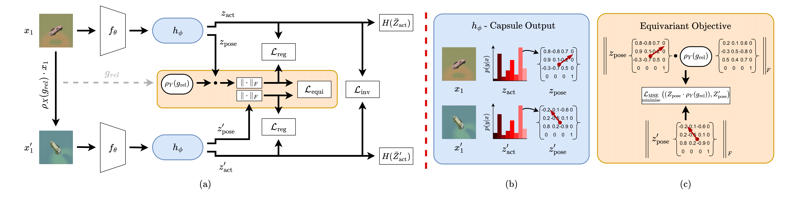
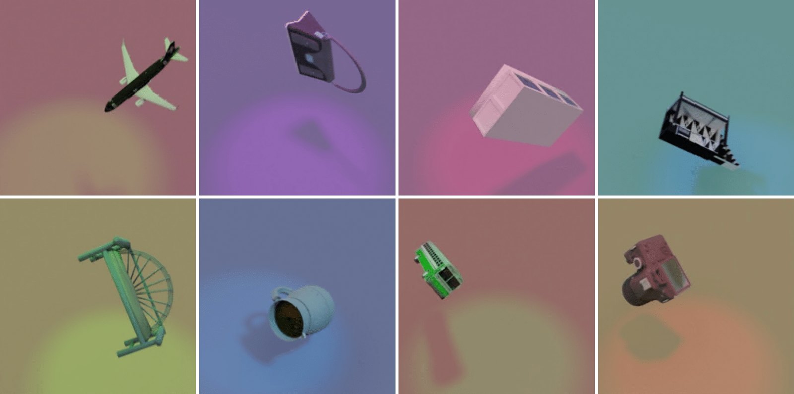

<h1 align="center">
  EquiCaps: Predictor-Free Pose-Aware Pre-Trained Capsule Networks
 </h1>
<p align="center">
  <a href="https://arxiv.org/abs/2506.09895"></a>   <a href="https://huggingface.co/datasets/athenacon/3DIEBench-T"></a>
</p>

<p align="center">
  <strong> 
  Athinoulla Konstantinou<sup>1,2*</sup>  Georgios Leontidis<sup>1,2</sup> Mamatha Thota<sup>3</sup> Aiden Durrant<sup>1</sup> </strong> <br/> 
  <sup>1</sup>School of Natural and Computing Sciences, University of Aberdeen, UK &nbsp;<br/>
  <sup>2</sup>Interdisciplinary Institute, University of Aberdeen, UK<br/>
  <sup>3</sup>School of Computer Science, University of Lincoln, UK<br/>
  <sup>*</sup>Corresponding author. Email: 
  <a href="mailto:a.konstantinou.24@abdn.ac.uk">
    a.konstantinou.24@abdn.ac.uk
  </a>
</p>

**Paper Summary**: 
We propose **EquiCaps** (Equivariant Capsule Network), a capsule-based self-supervised method that jointly learns invariant and equivariant representations. By leveraging capsules’ innate pose-awareness, EquiCaps shapes the latent space predictably, removing the need for a dedicated predictor. To enable richer benchmarking, we extend 3DIEBench to 3DIEBench-T, incorporating object translations alongside rotations. Empirically, EquiCaps achieves state-of-the-art rotation prediction on 3DIEBench, matching the performance of the fully supervised baseline. Extensive tests on 3DIEBench-T show that EquiCaps attains the highest rotation and object frame translation prediction among equivariant methods. Additionally, it is the only equivariant method that consistently achieves high equivariant performance on both rotation and translation, demonstrating its generalisation ability under multi-geometric equivariance learning, whereas the rest non-capsule-based equivariant methods achieve rotation prediction comparable to purely invariant methods. We hope our dataset enables the evaluation of invariant and equivariant representations under more challenging and realistic settings, and that our proposed method and results spark the exploration of alternative architectures.  



## Pretrained Models
You can download the complete pretrained model weights, including the projector (32 capsules).
<table>
  <tr>
    <th>Backbone</th>
    <th>Dataset</th>
    <th>Optimised for equivariance in </th>
    <th>Download</th>
    <th>Top-1 (%)</th>
    <th>Rotation (R<sup>2</sup>)</th>
    <th>Translation (R<sup>2</sup>)</th>
  </tr>
  <tr>
    <td>ResNet-18</td>
    <td>3DIEBench</td>
    <td>rotation</td>
    <td><a href="https://github.com/AberdeenML/EquiCaps/releases/download/v1.0-ckpts/EquiCaps_3DIEBench.pth">ckpt</a></td>
    <td>83.24</td>
    <td>0.78</td>
    <td>-</td>
  </tr>
  <tr>
    <td>ResNet-18</td>
    <td>3DIEBench-T</td>
    <td>rotation</td>
    <td><a href="https://github.com/AberdeenML/EquiCaps/releases/download/v1.0-ckpts/EquiCaps_3DIEBenchT_only_rotation.pth">ckpt</a></td>
    <td>76.91</td>
    <td>0.73</td>
    <td>0.60 (object frame) 0.88 (base frame)</td>
  </tr>
  <tr>
    <td>ResNet-18</td>
    <td>3DIEBench-T</td>
    <td>rotation and object frame translation</td>
    <td><a href="https://github.com/AberdeenML/EquiCaps/releases/download/v1.0-ckpts/EquiCaps_3DIEBenchT_with_object_transl.pth">ckpt</a></td>
    <td>78.25</td>
    <td>0.71</td>
    <td>0.62 (object frame)</td>
  </tr>
    <tr>
    <td>ResNet-18</td>
    <td>3DIEBench-T</td>
    <td>rotation and base frame translation</td>
    <td><a href="https://github.com/AberdeenML/EquiCaps/releases/download/v1.0-ckpts/EquiCaps_3DIEBenchT_with_base_transl.pth">ckpt</a></td>
    <td>77.88</td>
    <td>0.71</td>
    <td>0.91 (base frame)</td>
  </tr>
</table>

## Pretraining
The code is set up for distributed training for pretraining, but it can be easily adjusted to run on a single GPU. To pretrain EquiCaps on 3DIEBench-T, run the following command: 
```bash
python main.py --experience EquiCaps_3x3 \
    --exp-dir './exps/<run_name>/' \
    --root-log-dir './logs/' \
    --epochs 2000 \
    --arch resnet18 \
    --batch-size 256 \
    --base-lr 0.001 \
    --dataset-root 'path/to/3DIEBench-T' \
    --images-file ./data/train_images.npy \
    --labels-file ./data/train_labels.npy \
    --num-workers 32 \
    --sim-coeff  0.1 \
    --equi-factor 5 \
    --std-coeff 10 \
    --cov-coeff 1 \
    --mlp 1111-16-32 \
    --resolution 256
```

## Downstream Evaluation of Representations
The evaluation scripts are configured to run on a single GPU.
### Classification
Run the following command: 
```bash
python eval_classification.py \
    --dataset-root 'path/to/3DIEBench-T' \
    --exp-dir './exps/<run_name>/' \
    --root-log-dir './logs/' \
    --epochs 300 \
    --arch resnet18 \
    --batch-size 256 \
    --lr 0.001 \
    --wd 0.00000 \
    --num-workers 8 \
    --experience EquiCaps_3x3 \
    --mlp 1111-16-32 \
    --resolution 256 \
    --weights-file './path/to/ckpt'
```

### Rotation Prediction
Run the following command: 
```bash
python eval_angle_prediction.py \
    --dataset-root 'path/to/3DIEBench-T' \
    --exp-dir './exps/<run_name>/' \
    --root-log-dir './logs/' \
    --epochs 300 \
    --arch resnet18 \
    --batch-size 256 \
    --lr 0.001 \
    --wd 0.00000 \
    --experience EquiCaps_3x3 \
    --num-workers 8 \
    --mlp 1111-16-32 \
    --resolution 256 \
    --weights-file './path/to/ckpt'
```

### Translation Prediction - Object Frame
Run the following command: 
```bash
python eval_translation_prediction_object_frame.py \
    --dataset-root 'path/to/3DIEBench-T' \
    --exp-dir './exps/<run_name>/' \
    --root-log-dir './logs/' \
    --epochs 300 \
    --arch resnet18 \
    --batch-size 256 \
    --lr 0.001 \
    --wd 0.00000 \
    --num-workers 8 \
    --experience EquiCaps_3x3 \
    --mlp 1111-16-32 \
    --resolution 256 \
    --weights-file './path/to/ckpt'
```

### Translation Prediction - Base (Final) Frame
Run the following command: 
```bash
python eval_translation_prediction_final_frame.py \
    --dataset-root 'path/to/3DIEBench-T' \
    --exp-dir './exps/<run_name>/' \
    --root-log-dir './logs/' \
    --epochs 300 \
    --arch resnet18 \
    --batch-size 256 \
    --lr 0.001 \
    --wd 0.00000 \
    --num-workers 8 \
    --experience EquiCaps_3x3 \
    --mlp 1111-16-32 \
    --resolution 256 \
    --weights-file './path/to/ckpt'
```

### Colour Prediction 
Run the following command: 
```bash
python eval_color_prediction.py \
    --dataset-root 'path/to/3DIEBench-T' \
    --exp-dir './exps/<run_name>/' \
    --root-log-dir './logs/' \
    --epochs 50 \
    --arch resnet18 \
    --batch-size 256 \
    --lr 0.001 \
    --wd 0.00000 \
    --num-workers 8 \
    --experience EquiCaps_3x3 \
    --mlp 1111-16-32 \
    --resolution 256 \
    --weights-file './path/to/ckpt'
```

## 3DIEBench-T Dataset
The dataset introduced in this work is publicly available on [Hugging Face](https://huggingface.co/datasets/athenacon/3DIEBench-T).

The dataset is reproducible from scratch; details are given in the [dataset_generation](./dataset_generation/) directory. 
<p align="center">

</p>

## Requirements
PyTorch, Numpy, PIL, Tensorboard and Scipy.

## License
This code is released under the [GPL v3.0 License](./LICENSE). 

The 3DIEBench-T dataset is released under the [CC-BY-NC 4.0 License](./dataset_generation/LICENSE).

## Contribution and Contact
We do not anticipate pull requests for this repository. If you encounter any issues reproducing our experiments, please feel free to open an issue or contact the corresponding author of the paper directly.

## Acknowledgement 

This code is mostly built on the [SIE](https://github.com/facebookresearch/SIE) and [SR-CapsNet](https://github.com/coder3000/SR-CapsNet) repositories.

## Citation
```
@article{konstantinou2025equicaps,
  title={EquiCaps: Predictor-Free Pose-Aware Pre-Trained Capsule Networks},
  author={Konstantinou, Athinoulla and Leontidis, Georgios and Thota, Mamatha and Durrant, Aiden},
  journal={arXiv preprint arXiv:2506.09895},
  year={2025}
}
```
